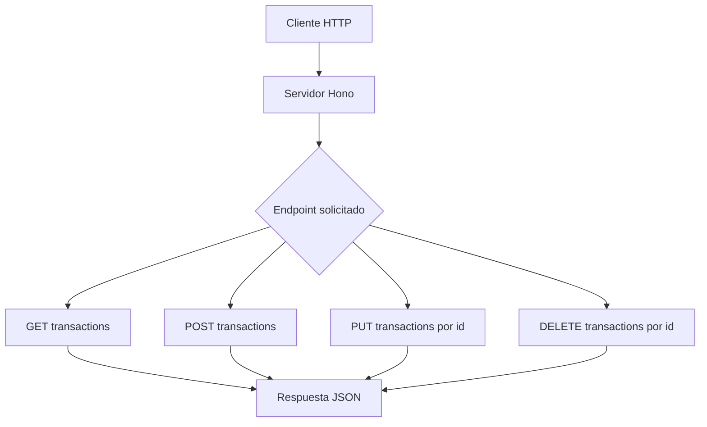
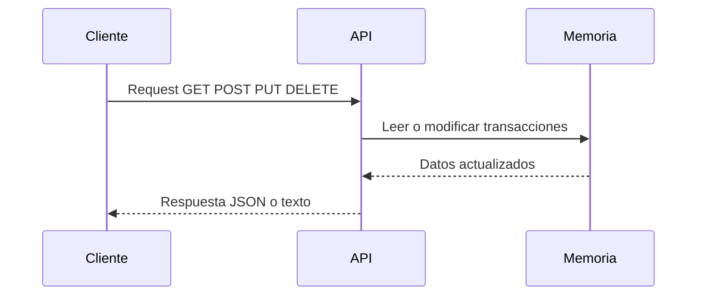

# Evaluación 1 Desarrollo Software Web2 - Sección 50 - 2026

[](https://hono.dev/)
[](https://nodejs.org/)
[](https://www.typescriptlang.org/)
[](LICENSE)

- Profesor: Boris Belmar Muñoz
- Alumno: Patricio Aliste Salas
---

🧾 API REST para gestionar transacciones financieras, construida con [Hono](https://hono.dev/) y ejecutada sobre Node.js.

## ✨ Descripción

Este proyecto expone una API sencilla para consultar, crear, actualizar y eliminar transacciones. Está pensada para pruebas con Bruno, Postman o cualquier cliente HTTP, y usa una estructura limpia para facilitar su mantenimiento.


## 🚀 Características

- CRUD básico de transacciones.
- Persistencia en memoria durante la ejecución del servidor.
- Estructura simple, ideal para prácticas y pruebas rápidas.
- Compatible con clientes HTTP como Bruno y Postman.

## 📹 Video de Demostración

[Ver demostración de la API](https://youtu.be/nT0WESpqvXw)

## 🧰 Tecnologías utilizadas

| Tecnología | Descripción |
| --- | --- |
| [Hono](https://hono.dev/) | Framework web ligero y rápido para construir APIs sobre JavaScript/TypeScript. |
| [Node.js](https://nodejs.org/) | Entorno de ejecución que permite correr la API del lado del servidor. |
| [TypeScript](https://www.typescriptlang.org/) | Lenguaje base del proyecto, aporta tipado estático y mejor mantenimiento. |
| [nodemon](https://nodemon.io/) | Reinicia automáticamente la aplicación durante el desarrollo. |
| [ts-node](https://typestrong.org/ts-node/) | Ejecuta TypeScript directamente sin compilar manualmente en desarrollo. |
| [tsup](https://tsup.egoist.dev/) | Herramienta de build para generar la versión compilada del proyecto. |
| [Bruno](https://www.usebruno.com/) | Cliente HTTP recomendado para probar los endpoints de la API. |

## 🛠️ Requisitos

- Node.js 18 o superior.
- Yarn.

## ⚡ Instalación

```bash
yarn install
```

## ▶️ Ejecución

### Modo desarrollo

```bash
yarn dev
```

### Compilación

```bash
yarn build
```

### Producción

```bash
yarn start
```

## 📦 Scripts disponibles

| Script | Descripción |
| --- | --- |
| `yarn dev` | Ejecuta el proyecto en modo desarrollo con `nodemon` y `ts-node`. |
| `yarn build` | Compila la aplicación a JavaScript en `dist/`. |
| `yarn start` | Inicia la versión compilada. |

## 🧭 Flujo general



## 🧩 Flujo de una petición



## 📚 Endpoints

| Método | Ruta | Descripción | Códigos HTTP |
| --- | --- | --- | --- |
| `GET` | `/` | Devuelve un mensaje de bienvenida. | `200 OK` |
| `GET` | `/transactions` | Devuelve todas las transacciones. | `200 OK` |
| `GET` | `/transactions/:id` | Devuelve una transacción por ID. | `200 OK`, `404 Not Found` |
| `POST` | `/transactions` | Crea una nueva transacción. | `201 Created` |
| `PUT` | `/transactions/:id` | Actualiza una transacción existente. | `200 OK`, `404 Not Found` |
| `DELETE` | `/transactions/:id` | Elimina una transacción por ID. | `200 OK`, `404 Not Found` |

## 🧩 Esquema de request

### POST /transactions

Campos:

- `description` (obligatorio): `string`.
- `amount` (obligatorio): `number`.
- `type` (obligatorio): `income` o `expense`.

```json
{
  "description": "Freelance project",
  "amount": 1200,
  "type": "income"
}
```

### PUT /transactions/:id

Campos:

- `description` (opcional): `string`.
- `amount` (opcional): `number`.
- `type` (opcional): `income` o `expense`.

```json
{
  "description": "Updated rent",
  "amount": 1100,
  "type": "expense"
}
```

Si un campo no se envía en el `PUT`, conserva el valor anterior.

Nota: en la implementación actual no hay validación estricta de tipos en runtime, por lo que estos campos deben respetarse desde el cliente (Bruno/Postman) para evitar datos inconsistentes.

## 🧪 Ejemplos para Bruno

### Crear una transacción

- Method: `POST`
- URL: `http://localhost:3000/transactions`
- Header: `Content-Type: application/json`
- Body: `JSON`

### Actualizar una transacción

- Method: `PUT`
- URL: `http://localhost:3000/transactions/1`
- Header: `Content-Type: application/json`
- Body: `JSON`

### Eliminar una transacción

- Method: `DELETE`
- URL: `http://localhost:3000/transactions/1`

## 🏗️ Estructura del proyecto

```text
.
├── nodemon.json
├── package.json
├── tsconfig.json
└── src
    └── index.ts
```

## 🗂️ Modelo de datos

```ts
type Transaction = {
  id: number
  description: string
  amount: number
  type: 'income' | 'expense'
}
```

## 📌 Notas importantes

- Los datos se almacenan en memoria, por lo que se pierden al reiniciar el servidor.
- El servidor escucha en `http://localhost:3000`.
- El endpoint `PUT` permite actualización parcial de campos.

## 🧾 Convenciones

- Las respuestas se devuelven en formato JSON siempre que aplica.
- Los identificadores de transacción son numéricos.
- El campo `type` acepta únicamente `income` o `expense`.